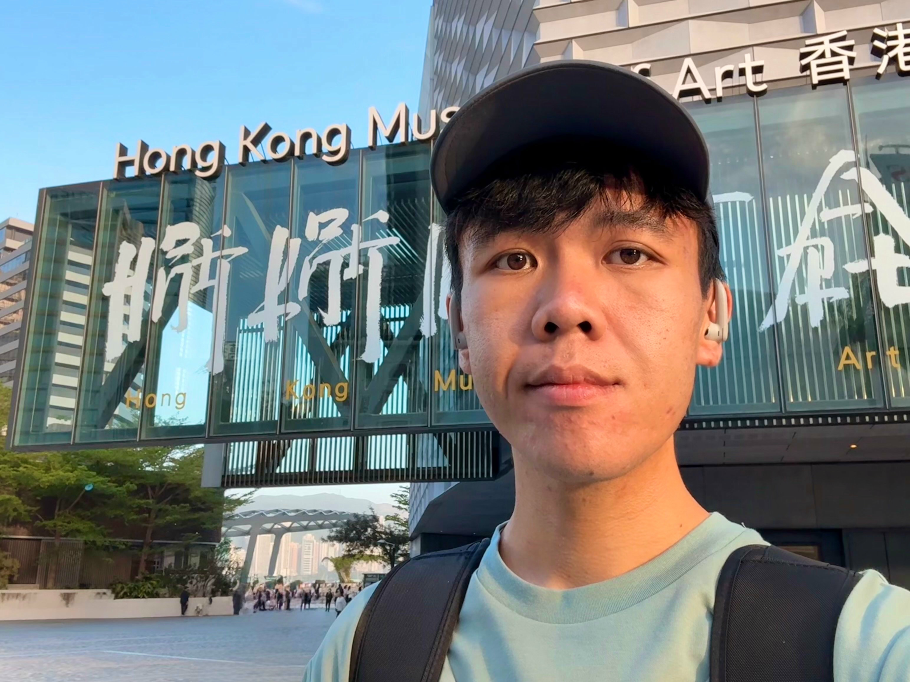

<!--
  =====================================================================
  THIS ONE FILE HOLDS ALL THE CONTENT OF THE WEBSITE.
  index.html is just a viewer that fetches and renders this file.

  How it works:
  - Every "# Heading" (a single #) becomes a TAB in the navigation.
  - "## Heading" is a section heading inside a tab.
  - "### Heading" is a smaller sub-heading (project titles, years).
  - Quote blocks (lines starting with ">") render as bordered cards —
    use them for publications and talks.
  - Any link pointing into files/ renders as a download button.
  - Standard Markdown works everywhere: **bold**, *italic*,
    [link](url), bullet lists, and inline HTML if you need it.
  - This comment block is invisible on the site.
  =====================================================================
-->

# About

<h1>Tommy YC Wong | 黃昱翔</h1>

PhD student in Linguistics, Hong Kong Baptist University

I am a PhD student in the Department of English Language and Literature at [Hong Kong Baptist University](https://www.hkbu.edu.hk/). My research lies in formal linguistics, with particular interests in the *ethics–linguistics interface* and *Optimality Theory*.

[Placeholder — a second short paragraph about your dissertation topic, your supervisor, and what questions drive your work. Two or three sentences is plenty.]

[Email](mailto:wongyc.tommy.acc@gmail.com) · [Google Scholar](#) · [ORCID](#) · [GitHub](#)

## News

- **Jun 2026** — [Placeholder] Paper accepted at *Journal of Formal Linguistics* — [PDF](files/wong-2026-placeholder-paper.pdf)
- **May 2026** — [Placeholder] Presented at a conference on Optimality Theory — [Slides](files/wong-2026-placeholder-slides.pdf)
- **Mar 2026** — [Placeholder] New manuscript on the ethics–linguistics interface available as a preprint
- **Jan 2026** — [Placeholder] Began serving as a teaching assistant for an introductory linguistics course
- **Feb 2026** — Achieved 

# Research

### The Ethics–Linguistics Interface

*Moral language · Normativity · Semantics–pragmatics*

[Placeholder — describe this project in 3–5 sentences: the central research question, your approach, and what is at stake. E.g., how moral vocabulary and normative claims interact with formal semantic and pragmatic theory.]

### Optimality Theory

*Constraint interaction · Phonology · Learnability*

[Placeholder — describe your OT work: which empirical domains you model, what constraint interactions you investigate, and any theoretical innovations you are developing.]

### Formal Linguistics

*Syntax · Semantics · Cantonese*

[Placeholder — describe a third strand of your research, for example formal analyses of phenomena in Cantonese or other languages you work on.]

# Publications

All PDFs are hosted on this site and free to download.

## Journal Articles

### 2026

> **[Placeholder] Constraint interaction at the ethics–linguistics interface**
> **Tommy Y.C. Wong**
> *Journal of Formal Linguistics*, 12(3), 245–278
> [PDF](files/wong-2026-placeholder-paper.pdf) [DOI](#) [BibTeX](#)

### 2025

> **[Placeholder] An Optimality-Theoretic account of a phenomenon in Cantonese**
> **Tommy Y.C. Wong** and Co-Author Name
> *Language and Linguistics*, 26(2), 101–134
> [PDF](files/wong-2025-placeholder-paper.pdf) [DOI](#) [BibTeX](#)

## Conference Proceedings

> **[Placeholder] Moral predicates and gradability: a formal analysis**
> **Tommy Y.C. Wong**
> *Proceedings of a Linguistics Conference*, 2025
> [PDF](files/wong-2025-placeholder-proceedings.pdf) [BibTeX](#)

## Manuscripts & Work in Progress

> **[Placeholder] Title of a manuscript under review**
> **Tommy Y.C. Wong**
> Under review · [request a draft](mailto:wongyc.tommy.acc@gmail.com)

## Edited Journal Issues

> **[Placeholder] Special issue: Ethics and the language sciences**
> Edited by **Tommy Y.C. Wong** and Co-Editor Name
> *Journal Name*, Volume 8, 2026
> [Full issue PDF](files/wong-2026-placeholder-journal-issue.pdf) [Publisher page](#)

# Talks

## Upcoming

> **[Placeholder] Title of an upcoming conference talk**
> Conference Name, City · September 2026

## Recent

> **[Placeholder] Optimality Theory and normative language**
> Invited talk, University Name · May 2026
> [Slides](files/wong-2026-placeholder-slides.pdf) [Handout](files/wong-2026-placeholder-handout.pdf)

> **[Placeholder] A talk given at a departmental seminar**
> HKBU Linguistics Seminar · February 2026
> [Handout](files/wong-2026-placeholder-handout.pdf)

## Earlier

> **[Placeholder] An earlier conference presentation**
> Conference Name, City · November 2025
> [Poster](files/wong-2025-placeholder-poster.pdf)

# CV

A brief overview — the full CV is available as a PDF.

[Download CV (PDF)](files/wong-cv.pdf)

## Education

- **PhD in Linguistics, Hong Kong Baptist University** — 2025–present · [Placeholder: supervisor, dissertation topic]
- **[Placeholder] MA in Linguistics, University Name** — 20XX–20XX
- **[Placeholder] BA in Language Studies, University Name** — 20XX–20XX

## Awards & Grants

- **[Placeholder] Postgraduate Studentship** — Hong Kong Baptist University, 2025
- **[Placeholder] Award or scholarship name** — Institution, 20XX

## Teaching

- **[Placeholder] Teaching Assistant, Introduction to Linguistics** — HKBU, Spring 2026

## Service

- **[Placeholder] Reviewer / organizing committee role** — Conference or journal name, 20XX
